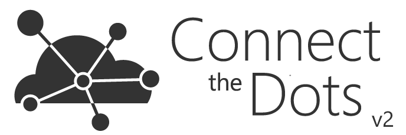
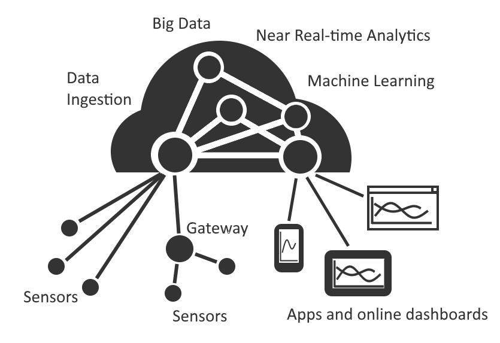

[ConnectTheDots.io](http://connectthedots.io) is an open source project created by Microsoft to help you get tiny devices connected to Microsoft Azure IoT, and to implement great IoT solutions taking advantage of Microsoft Azure advanced analytic services such as Azure Stream Analytics and Azure Machine Learning.

In this project there are code samples, configuration scripts and guides that will help you set up devices and sensors, and configure Microsoft Azure services to view and analyze the data produced by those devices. Some of these samples have been provided by Microsoft, others by third parties; we encourage everyone to submit code samples or configuration documentation to grow this project.

This project contains several device samples all aimed at helping you connect your devices to Azure IoT, as well as visualize and gain insight from your data.  Check out all the samples below, or follow the getting started walkthrough to learn more.  Then, add some of your devices to the project!

##What's new in the V2?##
Plenty!
The main change is the use of Azure IoT Hub instead of Event Hubs for connecting devices to the Cloud, but here is a list of what's new in V2

- Migrated from Event Hubs to Azure IoT Hub for the devices connectivity to Azure IoT: IoT Hub offers a better security with a per device authentication, along with a bidirectional messaging infrastructure.
- Replaced the Azure Prep tool with an ARM Template: you can now deploy the whole solution (including the WebSite) from a command line not only on Windows, but also no a Mac or a Linux machine!
- Updated devices samples
    - Updated all the node.js samples to use the Azure IoT Hub SDK
    - Removed old devices samples (Galileo, .Net Micro Framework)
    - Updated the Gateway code to use Azure IoT Hub device SDK
    - Upgraded WP8 samples (Simulated Sensors and MS Band) to Windows 10 UWP apps
    - Added Xamarin samples 

##Where is the V1 if I still want to use the old fashion way (using Event Hub)?##
The V1 has been tagged and you can find the release as a binary [here](https://github.com/Azure/connectthedots/releases/tag/1.0)
We also created a [branch](https://github.com/Azure/connectthedots/tree/V1) that we will not make additions to any more but will definitively track to merge your contributions.

##What Now?##

###[Getting Started](GettingStarted.md)###

If you're new to the project, we recommend the [Getting Started](GettingStarted.md) section which guides you through building a simple temperature sensing network using a Raspberry Pi gateway and Arduino sensor devices.  

###[Introduction](Introduction.md)###
Visit the [Introduction](Introduction.md) page for more details into how the project works.

###[Available Devices](SupportedDevices.md)###
For a full list of devices and code samples check out the ever growing list of [supported gateways and sensors](SupportedDevices.md).
